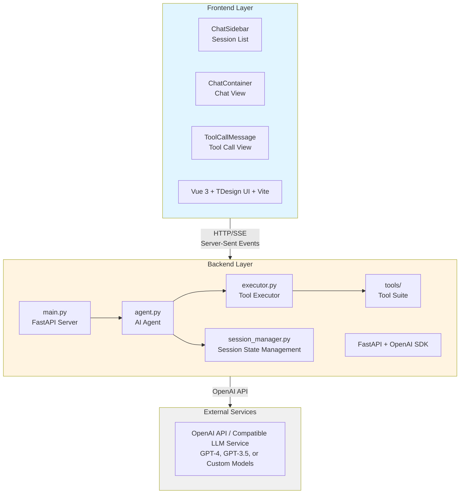
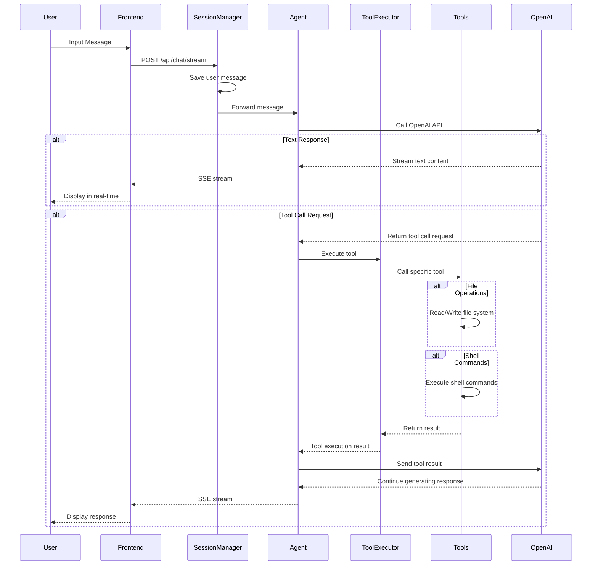

# IriBot - Lightweight AI Agent Chat System

A full-featured AI agent application with tool calling capabilities and real-time conversation experience. Built with Python FastAPI backend + Vue 3 frontend full-stack architecture.

## 🚀 Quick Start

- Install: `pip install iridet-bot`
- Find an empty directory for the agent, and run: `iribot`
- To specify host and port: `iribot --host 0.0.0.0 --port 8080`
- (Optional, Recommended) Copy some skills to `skills` directory

## ✨ Key Features

### 🤖 AI Agent Conversation

- Intelligent conversation powered by OpenAI API
- Streaming response support for real-time AI replies
- Image input support (vision capabilities)
- Customizable system prompts

### 🛠️ Tool Calling System

The agent can autonomously call the following tools to complete tasks:

- **File Operations**
  - `read_file` - Read file contents
  - `write_file` - Create or modify files
  - `list_directory` - List directory contents

- **Command Execution**
  - `shell_start` - Start an interactive shell session
  - `shell_run` - Execute commands in shell
  - `shell_read` - Read shell output
  - `shell_write` - Write input to shell
  - `shell_stop` - Stop shell session

### 💬 Session Management

- Multi-session support, create multiple independent conversations
- Persistent session history storage
- Session list management (create, switch, delete)
- Independent system prompts for each session

### 🎨 Modern UI

- Beautiful interface based on TDesign component library
- Real-time tool call status display
- Markdown message rendering support
- Responsive design for different screen sizes

## 🏗️ System Architecture



### Data Flow



## 🚀 Quick Start

### Requirements

- Python 3.8+
- Node.js 16+
- OpenAI API Key (or compatible LLM service)

### Installation

#### 1. Clone the Repository

```bash
git clone <repository-url>
cd mybot
```

#### 2. Backend Setup

```bash
cd iribot

# Create virtual environment (recommended)
python -m venv venv
source venv/bin/activate  # Windows: venv\Scripts\activate

# Install dependencies
pip install -r requirements.txt

# Configure environment variables
cp .env.example .env
# Edit .env file and add your OpenAI API Key
```

`.env` configuration example:

```ini
OPENAI_API_KEY=sk-xxxxxxxxxxxxxxxxxxxxxxxxxxxxxxxx
OPENAI_MODEL=gpt-4-turbo-preview
# OPENAI_BASE_URL=https://api.openai.com/v1  # Optional, use custom API endpoint
DEBUG=false
```

#### 3. Frontend Setup

```bash
cd frontend

# Install dependencies
npm install
```

#### 4. Start Services

##### Using Automated Scripts (Recommended)

**Windows:**

```bash
# In project root directory
./setup.bat
```

**Linux/macOS:**

```bash
# In project root directory
chmod +x setup.sh
./setup.sh
```

##### Manual Start

**Backend:**

```bash
cd iribot
uvicorn main:app --reload --port 8000
```

**Frontend:**

```bash
cd frontend
npm run dev
```

## 🔧 Configuration

### Backend Configuration

Configure in `iribot/.env` file:

| Config Item       | Description          | Default                |
| ----------------- | -------------------- | ---------------------- |
| `OPENAI_API_KEY`  | OpenAI API key       | Required               |
| `OPENAI_MODEL`    | Model to use         | `gpt-4-vision-preview` |
| `OPENAI_BASE_URL` | Custom API endpoint  | Empty (use official)   |
| `DEBUG`           | Debug mode           | `false`                |
| `BASH_PATH`       | Bash executable path | `bash`                 |

### Frontend Configuration

Frontend connects to backend via Vite proxy. Configuration file: `frontend/vite.config.js`

```javascript
export default {
  server: {
    proxy: {
      "/api": {
        target: "http://localhost:8000",
        changeOrigin: true,
      },
    },
  },
};
```

## 🔌 API Endpoints

### Session Management

- `POST /api/sessions` - Create new session
- `GET /api/sessions` - Get session list
- `GET /api/sessions/{session_id}` - Get session details
- `DELETE /api/sessions/{session_id}` - Delete session

### Chat Interface

- `POST /api/chat/stream` - Send message (SSE streaming response)

### Tool Status

- `GET /api/tools/status` - Get all tool statuses

## 🛠️ Extension Development

### Adding New Tools

1. Create a new tool file in the `iribot/tools/` directory
2. Inherit from `BaseTool` class:

```python
from tools.base import BaseTool

class MyCustomTool(BaseTool):
    @property
    def name(self) -> str:
        return "my_custom_tool"

    @property
    def description(self) -> str:
        return "Tool description"

    @property
    def parameters(self) -> dict:
        return {
            "type": "object",
            "properties": {
                "param1": {
                    "type": "string",
                    "description": "Parameter description"
                }
            },
            "required": ["param1"]
        }

    def execute(self, **kwargs) -> dict:
        # Implement tool logic
        return {
            "success": True,
            "result": "Execution result"
        }
```

3. Register the tool in `executor.py`:

```python
def _register_default_tools(self):
    # ... other tools
    self.register_tool(MyCustomTool())
```

### Adding New Frontend Components

Add tool call visualization components in the `frontend/src/components/tool-calls/` directory.

## 📝 Tech Stack

### Backend

- **FastAPI** - Modern, fast web framework
- **OpenAI SDK** - LLM interface calling
- **Pydantic** - Data validation and settings management
- **Uvicorn** - ASGI server

### Frontend

- **Vue 3** - Progressive JavaScript framework
- **TDesign** - Enterprise-level UI component library
- **Vite** - Next-generation frontend build tool
- **Marked** - Markdown parser

## 🤝 Contributing

Issues and Pull Requests are welcome!

## 📄 License

MIT License

## 🔗 Related Links

- [OpenAI API Documentation](https://platform.openai.com/docs)
- [FastAPI Documentation](https://fastapi.tiangolo.com/)
- [Vue 3 Documentation](https://vuejs.org/)
- [TDesign Documentation](https://tdesign.tencent.com/vue-next/overview)

---

**Note:** Using this project requires a valid OpenAI API Key or compatible LLM service endpoint.
