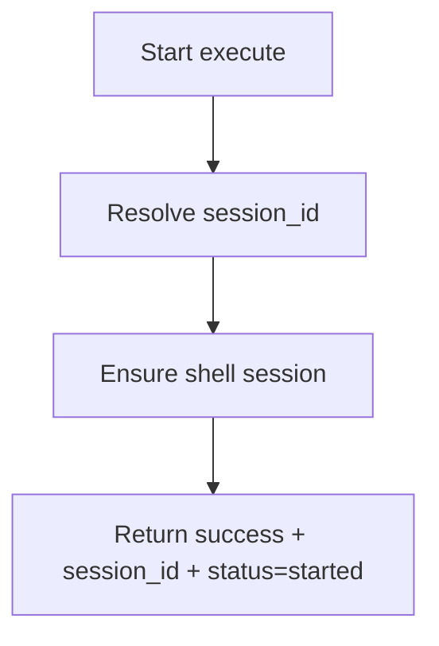
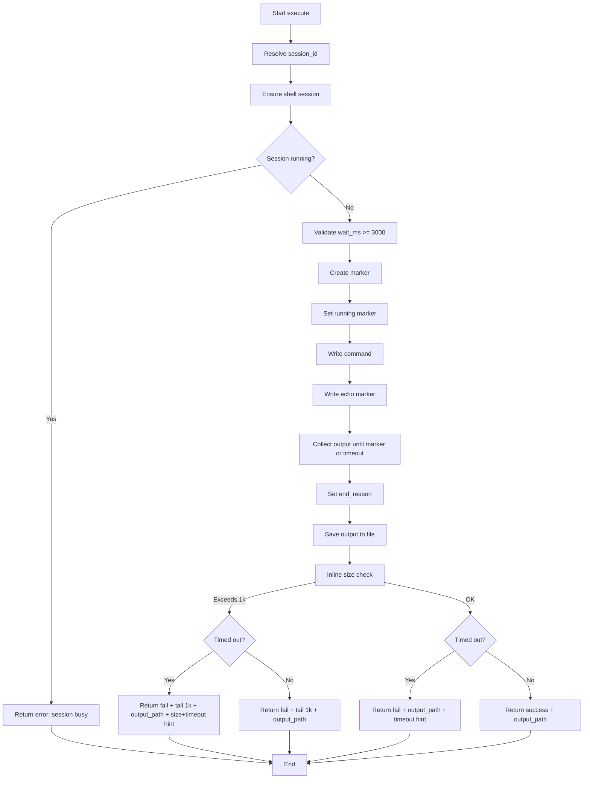
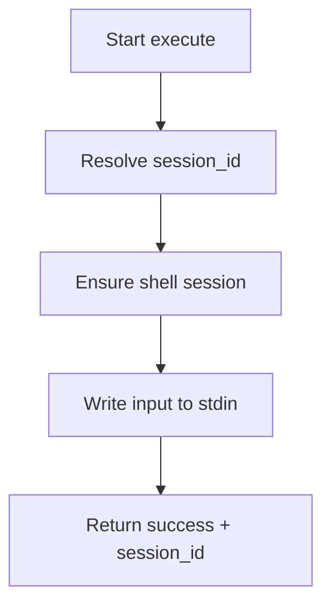
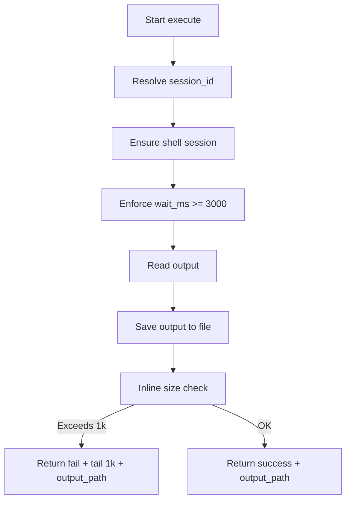
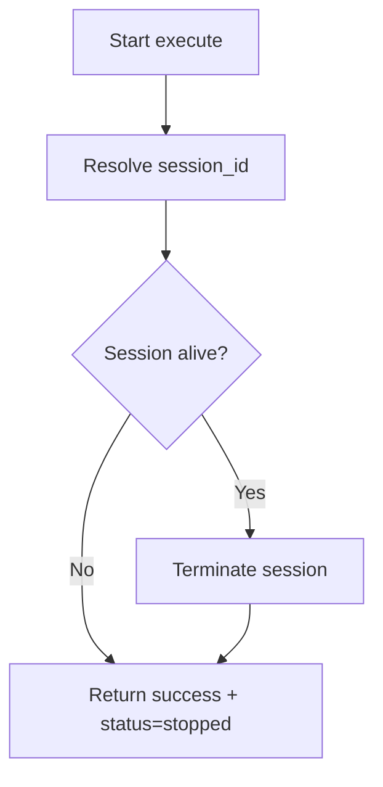

# Shell Tool Flows

## ShellStartTool.execute Flow

```mermaid
flowchart TD
    A[Start execute] --> B[Resolve session_id]
    B --> C[Ensure shell session]
    C --> D[Return success + session_id + status=started]
```

## ShellRunTool.execute Flow

```mermaid
flowchart TD
    A[Start execute] --> B[Resolve session_id]
    B --> C[Ensure shell session]
    C --> D{Session running?}
    D -- Yes --> E[Return error: session busy]
    D -- No --> F[Validate wait_ms >= 3000]
    F --> G[Create marker]
    G --> H[Set running marker]
    H --> I[Write command]
    I --> J[Write echo marker]
    J --> K[Collect output until marker or timeout]
    K --> L[Set end_reason]
    L --> M[Save output to file]
    M --> N[Inline size check]
    N -- Exceeds 1k --> O{Timed out?}
    N -- OK --> P{Timed out?}
    O -- Yes --> Q[Return fail + tail 1k + output_path + size+timeout hint]
    O -- No --> R[Return fail + tail 1k + output_path]
    P -- Yes --> S[Return fail + output_path + timeout hint]
    P -- No --> T[Return success + output_path]
    E --> Z[End]
    Q --> Z
    R --> Z
    S --> Z
    T --> Z
```

## ShellWriteTool.execute Flow

```mermaid
flowchart TD
    A[Start execute] --> B[Resolve session_id]
    B --> C[Ensure shell session]
    C --> D[Write input to stdin]
    D --> E[Return success + session_id]
```

## ShellReadTool.execute Flow

```mermaid
flowchart TD
    A[Start execute] --> B[Resolve session_id]
    B --> C[Ensure shell session]
    C --> D[Enforce wait_ms >= 3000]
    D --> E[Read output]
    E --> F[Save output to file]
    F --> G[Inline size check]
    G -- Exceeds 1k --> H[Return fail + tail 1k + output_path]
    G -- OK --> I[Return success + output_path]
```

## ShellStopTool.execute Flow

```mermaid
flowchart TD
    A[Start execute] --> B[Resolve session_id]
    B --> C{Session alive?}
    C -- No --> D[Return success + status=stopped]
    C -- Yes --> E[Terminate session]
    E --> D
```
